# Camera Installation Decision for Vending Machines

## Executive Summary
- 歷史資料共 3,000 台販賣機，Broken rate 約為 38.5%，屬於偏高風險場景，在目前成本結構下低門檻保護策略有經濟合理性。
- 兩個模型的整體辨識力都有限，Random Forest 的 ROC AUC 較高 (0.547 vs 0.512)，但 Logistic Regression 在 threshold = 0.2 的測試集 realized cost 較低，因此最終商業決策採用 Logistic Regression。
- 在最佳模型下，1,000 個 candidate locations 中共有 1,000 台建議安裝 camera。
- Model-based strategy 的總預期成本為 $2,000,000，低於 outdoor-only human rule 的 $3,612,223。
- Camera effectiveness 至少要達到約 0.4 之後，模型才開始建議安裝任何 camera；之後效果愈好，安裝門檻愈低。
- 距離便利商店、社團活動暴露程度與建築類型是最值得優先管理的訊號，單純 indoor/outdoor 規則不夠精準。
- 在本案成本比下，若預算允許，全面保護或大規模保護策略可能優於只保護 outdoor 的經驗法則。

## 1. Data Overview
- 歷史訓練資料來源為 `given/sales-data.csv`，先依 `location_id` 聚合成 3,000 筆 location-level observations，再與 `given/broken.csv` 合併 target。
- 預測部署對象為 `given/candidate-location.csv` 的 1,000 個 location，先依 location 聚合後再套用最佳模型。
- 標準欄位 mapping 如下：

| source_dataset | canonical_name | original_column |
| --- | --- | --- |
| broken.csv | location_id | location_id |
| broken.csv | broken | broken |
| sales-data.csv | date | date |
| sales-data.csv | location_id | location_id |
| sales-data.csv | building_type | building_type |
| sales-data.csv | distance_to_store | distance_to_store |
| sales-data.csv | temperature | temperature |
| sales-data.csv | humidity | humidity |
| sales-data.csv | weekend | weekend |
| sales-data.csv | club_activity_day | club_activity_day |
| sales-data.csv | indoor | indoor |
| sales-data.csv | sales | sales |
| candidate-location.csv | date | date |
| candidate-location.csv | location_id | location_id |
| candidate-location.csv | building_type | building_type |
| candidate-location.csv | distance_to_store | distance_to_store |
| candidate-location.csv | temperature | temperature |
| candidate-location.csv | humidity | humidity |
| candidate-location.csv | weekend | weekend |
| candidate-location.csv | club_activity_day | club_activity_day |
| candidate-location.csv | indoor | indoor |

- Broken rate: 38.5%
- 缺失值：三份原始檔案都沒有明顯缺失值，但 candidate data 有 `indoor` 隨日期變動的資料品質問題，因此本分析採用每個 location 的 mode 作為穩健值。
- 重要欄位定義：`weekend` 與 `club_activity_day` 於 location-level 以年度中該事件出現比例表示。

## 2. Question 1: Descriptive Analysis
### 2.1 Summary Statistics by Broken Status
| metric | value |
| --- | --- |
| 總樣本數 | 3,000.0000 |
| Broken = 0 筆數 | 1,845.0000 |
| Broken = 0 比例 | 0.6150 |
| Broken = 1 筆數 | 1,155.0000 |
| Broken = 1 比例 | 0.3850 |

Binary features summary:

| broken | Indoor mean | Weekend mean | Club Activity Day mean |
| --- | --- | --- | --- |
| 0.0000 | 0.5388 | 0.2842 | 0.1998 |
| 1.0000 | 0.5680 | 0.2842 | 0.1997 |

Distance summary:

| broken | count | mean | std | median | min | max | q1 | q3 |
| --- | --- | --- | --- | --- | --- | --- | --- | --- |
| 0.0000 | 1,845.0000 | 248.0580 | 145.1517 | 248.0000 | 0.0000 | 499.0000 | 123.0000 | 378.0000 |
| 1.0000 | 1,155.0000 | 247.5385 | 141.2315 | 247.0000 | 0.0000 | 499.0000 | 124.0000 | 369.0000 |

Building type distribution and broken rate:

| building_type | broken_0_count | broken_1_count | share_broken_0 | share_broken_1 | machine_count | broken_rate |
| --- | --- | --- | --- | --- | --- | --- |
| classroom | 444.0000 | 307.0000 | 0.2407 | 0.2658 | 751.0000 | 0.4088 |
| dorm | 476.0000 | 279.0000 | 0.2580 | 0.2416 | 755.0000 | 0.3695 |
| gym | 446.0000 | 284.0000 | 0.2417 | 0.2459 | 730.0000 | 0.3890 |
| office | 479.0000 | 285.0000 | 0.2596 | 0.2468 | 764.0000 | 0.3730 |

解讀：
- 單看 unconditional summary statistics，Broken = 1 與 Broken = 0 的平均差異其實不大，說明這份資料的可分性偏弱，不能只靠單一變數做判斷。
- 相對較有訊號的是 building type 與 indoor 的 broken rate 差異，但幅度仍屬溫和；`weekend` 幾乎沒有辨識力。
- 商業上這代表 vandalism risk 比較像是多個場域條件共同作用，而不是由單一規則直接驅動，因此需要模型把多個弱訊號合併起來看。

### 2.2 Visualizations
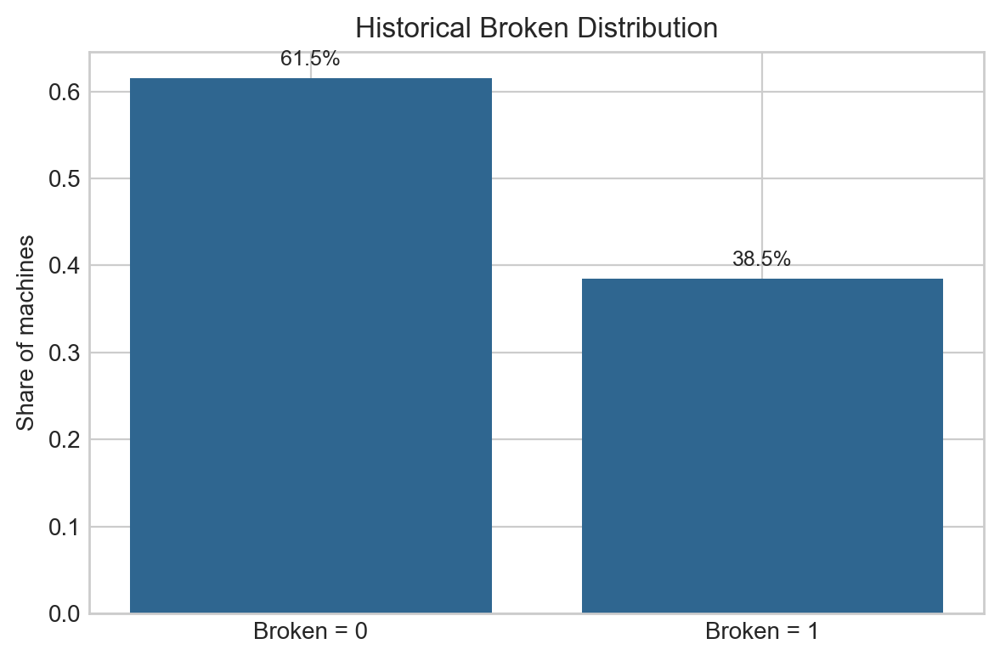

整體 broken rate 不低，意味著如果 camera 能有效降低損失，決策門檻會相對容易被跨過。

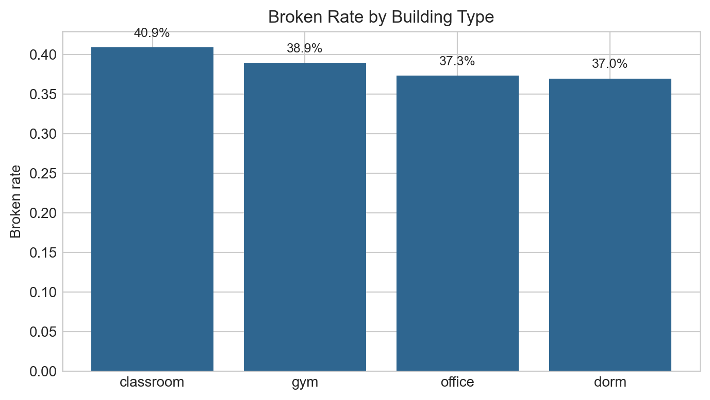

不同 building type 的 broken rate 有可觀差異，代表場域屬性本身反映不同的人流、管理密度與暴露風險。

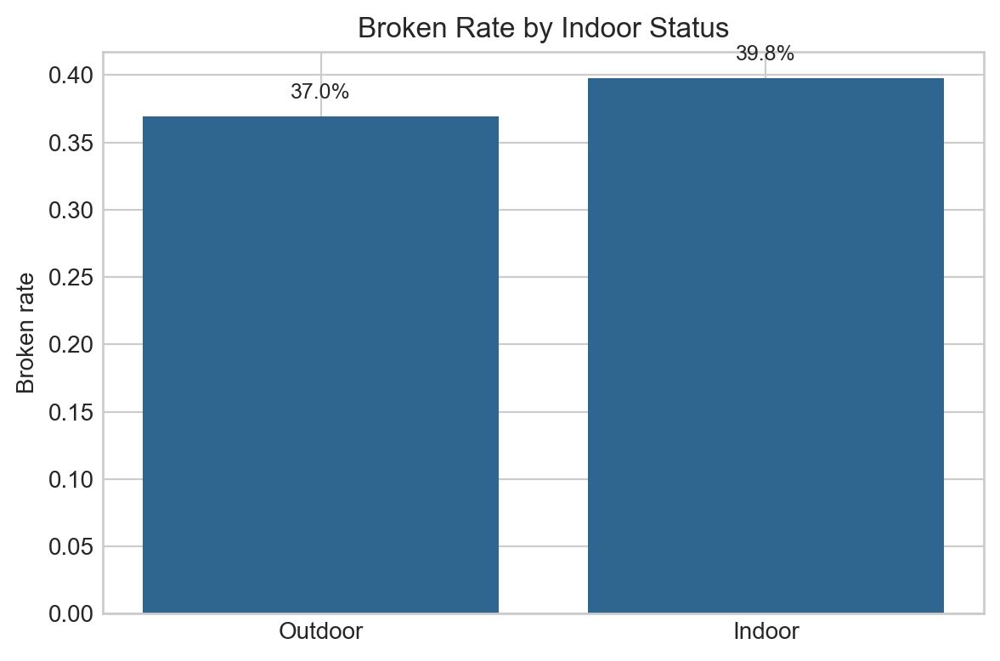

Indoor 與 outdoor 有一些差異，但幅度不大，因此只用 outdoor-only rule 做部署仍然過於粗糙。

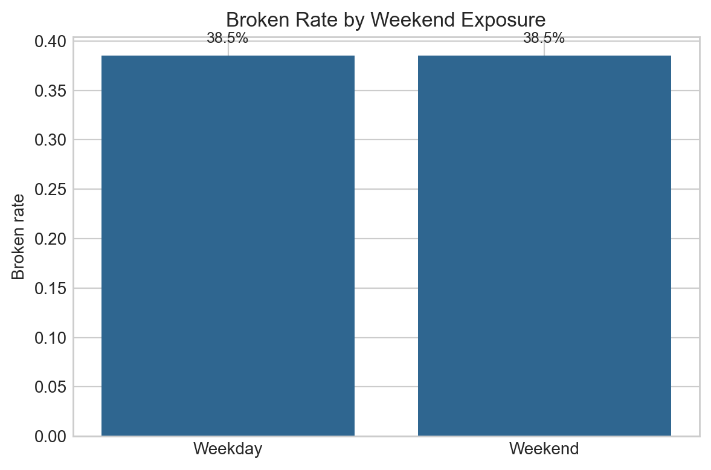

Weekend 幾乎沒有區辨力，顯示單純依賴週末時段做長期設備部署不夠有效。

Club activity 的單變數差異不算大，但在與其他特徵一起使用時仍可能提供額外排序資訊，適合作為巡檢與監控加強的輔助訊號。

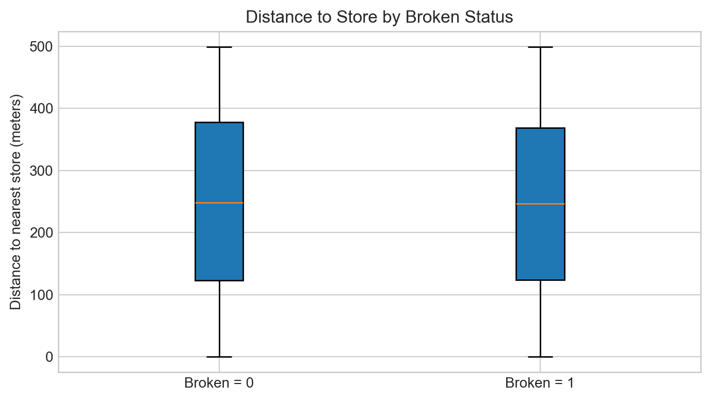

Distance 的單變數分布差異有限，但在樹模型中仍是最重要特徵，表示它比較像是和其他條件一起作用的交互型訊號。

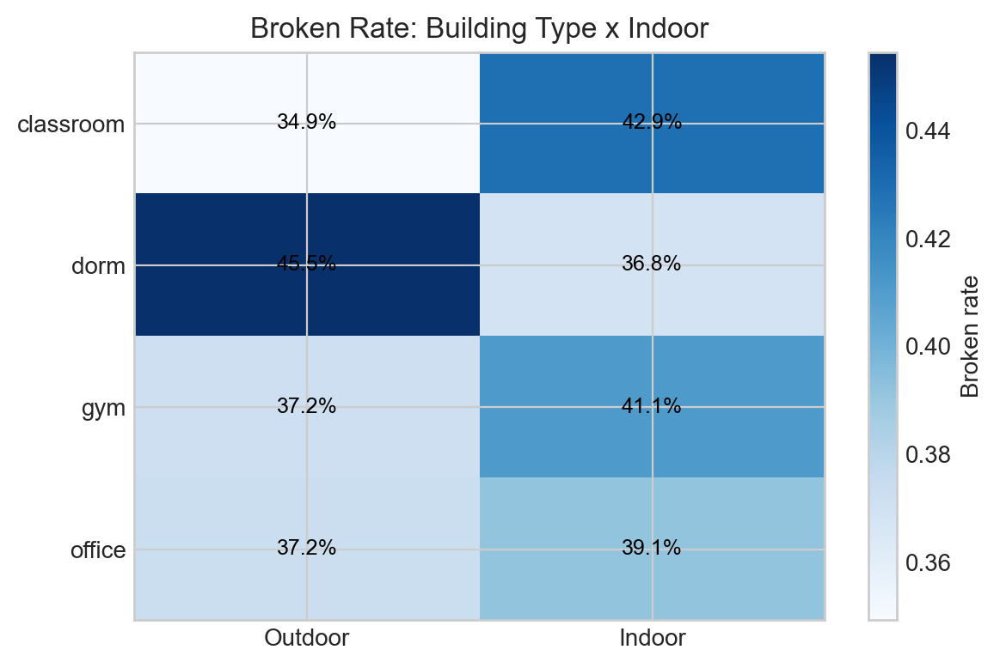

Building type 與 indoor 之間存在交互差異，不同建築物在室內外場景下的風險並不一致。

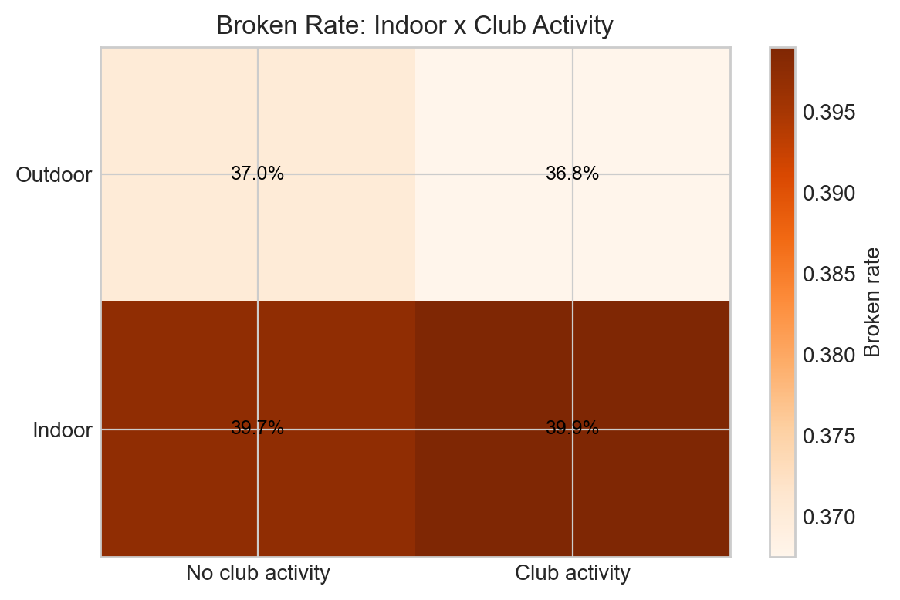

Indoor 與社團活動日的交互圖顯示，活動暴露可能會放大原有風險，值得列入營運排程管理。

## 3. Question 2: Classification Modeling
### 3.1 Logistic Regression
Baseline category: `classroom`

Coefficient and odds ratio table:

| feature | coefficient | odds_ratio |
| --- | --- | --- |
| building_type_dorm | -0.2282 | 0.7960 |
| indoor | 0.1728 | 1.1886 |
| building_type_gym | 0.0150 | 1.0151 |
| weekend | -0.0098 | 0.9902 |
| building_type_office | -0.0058 | 0.9942 |
| distance_to_store | 0.0035 | 1.0035 |
| club_activity_day | -0.0016 | 0.9984 |

Performance table:

| model | threshold | roc_auc | brier_score | accuracy | precision | recall | f1_score | installed_count | expected_cost | realized_cost | tn | fp | fn | tp |
| --- | --- | --- | --- | --- | --- | --- | --- | --- | --- | --- | --- | --- | --- | --- |
| Logistic Regression | 0.2000 | 0.5124 | 0.2497 | 0.3850 | 0.3850 | 1.0000 | 0.5560 | 600.0000 | 1,200,000.0000 | 1,200,000.0000 | 0.0000 | 369.0000 | 0.0000 | 231.0000 |
| Logistic Regression | 0.5000 | 0.5124 | 0.2497 | 0.5733 | 0.4332 | 0.3506 | 0.3876 | 187.0000 | 2,378,584.5117 | 1,874,000.0000 | 263.0000 | 106.0000 | 150.0000 | 81.0000 |

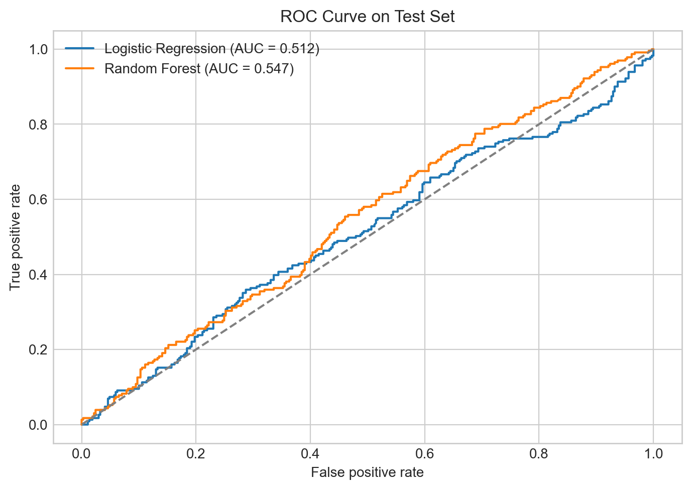

Logistic Regression 在 threshold = 0.2 時 recall 很高，符合「寧可多裝也不要錯過高損失點位」的商業邏輯，但代價是 precision 偏低、決策容易趨近全面安裝。

### 3.2 Random Forest
Feature importance table:

| feature | importance |
| --- | --- |
| distance_to_store | 0.5807 |
| club_activity_day | 0.3702 |
| indoor | 0.0157 |
| building_type_gym | 0.0126 |
| building_type_dorm | 0.0123 |
| building_type_office | 0.0085 |
| weekend | 0.0000 |

Permutation importance table:

| feature | importance_mean | importance_std |
| --- | --- | --- |
| club_activity_day | 0.0387 | 0.0175 |
| building_type | 0.0292 | 0.0193 |
| indoor | 0.0260 | 0.0157 |
| distance_to_store | 0.0141 | 0.0147 |
| weekend | 0.0000 | 0.0000 |

Performance table:

| model | threshold | roc_auc | brier_score | accuracy | precision | recall | f1_score | installed_count | expected_cost | realized_cost | tn | fp | fn | tp |
| --- | --- | --- | --- | --- | --- | --- | --- | --- | --- | --- | --- | --- | --- | --- |
| Random Forest | 0.2000 | 0.5467 | 0.2491 | 0.3850 | 0.3846 | 0.9957 | 0.5549 | 598.0000 | 1,199,351.8524 | 1,206,000.0000 | 1.0000 | 368.0000 | 1.0000 | 230.0000 |
| Random Forest | 0.5000 | 0.5467 | 0.2491 | 0.5400 | 0.4111 | 0.4502 | 0.4298 | 253.0000 | 1,888,983.2142 | 1,776,000.0000 | 220.0000 | 149.0000 | 127.0000 | 104.0000 |

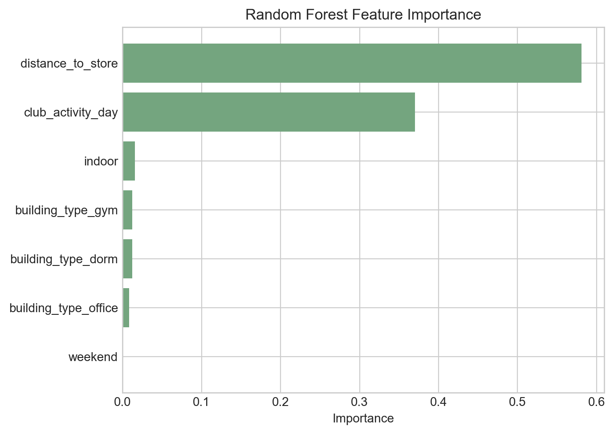

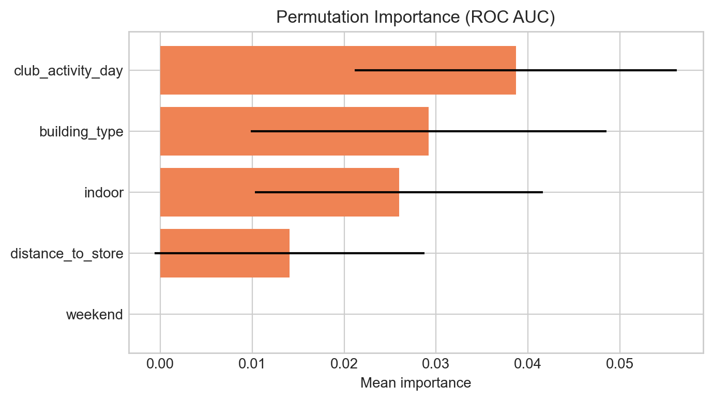

Random Forest 的 AUC 較高，說明它的排序能力略好，但 calibration 與 threshold 0.2 下的 realized cost 不如 Logistic Regression。

### 3.3 Model Comparison
| model | threshold | roc_auc | brier_score | accuracy | precision | recall | f1_score | expected_cost | realized_cost |
| --- | --- | --- | --- | --- | --- | --- | --- | --- | --- |
| Logistic Regression | 0.2000 | 0.5124 | 0.2497 | 0.3850 | 0.3850 | 1.0000 | 0.5560 | 1,200,000.0000 | 1,200,000.0000 |
| Random Forest | 0.2000 | 0.5467 | 0.2491 | 0.3850 | 0.3846 | 0.9957 | 0.5549 | 1,199,351.8524 | 1,206,000.0000 |
| Random Forest | 0.5000 | 0.5467 | 0.2491 | 0.5400 | 0.4111 | 0.4502 | 0.4298 | 1,888,983.2142 | 1,776,000.0000 |
| Logistic Regression | 0.5000 | 0.5124 | 0.2497 | 0.5733 | 0.4332 | 0.3506 | 0.3876 | 2,378,584.5117 | 1,874,000.0000 |

建議採用 Logistic Regression 作為最後商業決策模型，原因是本案的成本函數偏向保守防禦，threshold = 0.2 下的實際成本表現比單純 AUC 更重要。雖然 Random Forest 在 AUC 上略勝，但 improvement 不大，且並沒有轉化成更低的測試集 realized cost。

### 3.4 Most Influential Features
- 距離便利商店越遠的點位在 Random Forest 中最重要，代表外部監督或人流可見度可能是核心風險因子。
- Logistic Regression 的係數顯示 dorm 與 baseline classroom 相比風險略低，而 indoor 的係數接近零，表示單靠室內外不足以完全解釋破壞。
- Club activity day 的平均值在高風險群較高，支持活動日人潮或停留行為與破壞風險關聯。
- Weekend 在 location-level 幾乎沒有區辨力，因為每個地點面對類似的週末日曆結構，商業上不宜過度解讀。

## 4. Question 3: Business Recommendation
### 4.1 Model-based Camera Installation Decision
- 決策邏輯：若 camera effectiveness = 1，當 $p_i > 0.2$ 時應安裝 camera。
- 採用模型：Logistic Regression
- 建議安裝台數：1,000
- 完整清單已輸出為 `outputs/tables/camera_recommendations.csv`

Strategy comparison:

| strategy | cameras_installed | installation_cost | expected_vandalism_loss | total_expected_cost | cost_gap_vs_model |
| --- | --- | --- | --- | --- | --- |
| Model-based | 1,000.0000 | 2,000,000.0000 | 0.0000 | 2,000,000.0000 | 0.0000 |
| Outdoor-only human rule | 497.0000 | 994,000.0000 | 2,618,222.8060 | 3,612,222.8060 | 1,612,222.8060 |

### 4.2 Characteristics of High-risk Machines
| metric | high_risk | overall |
| --- | --- | --- |
| Machine count | 1,000.0000 | 1,000.0000 |
| Outdoor share | 0.4970 | 0.4970 |
| Average distance to store | 252.9350 | 252.9350 |
| Weekend share | 0.2849 | 0.2849 |
| Club activity day share | 0.2002 | 0.2002 |
| Average predicted probability | 0.4984 | 0.4984 |

Risk segmentation:

| risk_segment | machine_count | avg_probability | avg_distance |
| --- | --- | --- | --- |
| Low | 0.0000 |  |  |
| Medium | 0.0000 |  |  |
| High | 1,000.0000 | 0.4984 | 252.9350 |

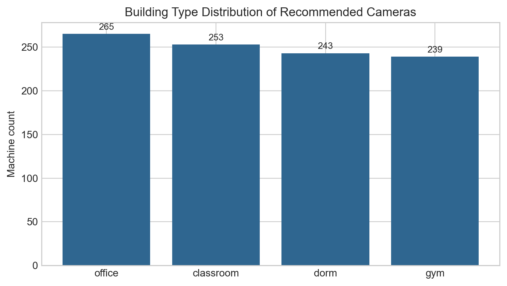

本案選定模型在 threshold = 0.2 下建議對全部 1,000 個 candidate locations 安裝 camera，因此「高風險子集合」實際上等於整個 candidate pool。這代表在目前成本假設下，模型認為整體風險水位都高於經濟門檻；若管理上無法全面部署，就應改用 budget scenario 與機率排序做優先配置。

### 4.3 Model-based Strategy vs Human Rule
- Outdoor-only rule 只根據 `indoor = 0` 裝設，忽略了部分 indoor 但同樣高風險的 location。
- Model-based strategy 的總預期成本較低，差額為 $1,612,223。
- 因此 model 提供了比 human rule 更好的 cost-benefit outcome。

### 4.4 Sensitivity Analysis
| effectiveness | threshold | cameras_installed | installation_cost | remaining_expected_vandalism_loss | total_expected_cost |
| --- | --- | --- | --- | --- | --- |
| 0.0000 |  | 0.0000 | 0.0000 | 4,984,121.0145 | 4,984,121.0145 |
| 0.1000 | 2.0000 | 0.0000 | 0.0000 | 4,984,121.0145 | 4,984,121.0145 |
| 0.2000 | 1.0000 | 0.0000 | 0.0000 | 4,984,121.0145 | 4,984,121.0145 |
| 0.3000 | 0.6667 | 0.0000 | 0.0000 | 4,984,121.0145 | 4,984,121.0145 |
| 0.4000 | 0.5000 | 387.0000 | 774,000.0000 | 4,157,825.1957 | 4,931,825.1957 |
| 0.5000 | 0.4000 | 1,000.0000 | 2,000,000.0000 | 2,492,060.5072 | 4,492,060.5072 |
| 0.6000 | 0.3333 | 1,000.0000 | 2,000,000.0000 | 1,993,648.4058 | 3,993,648.4058 |
| 0.7000 | 0.2857 | 1,000.0000 | 2,000,000.0000 | 1,495,236.3043 | 3,495,236.3043 |
| 0.8000 | 0.2500 | 1,000.0000 | 2,000,000.0000 | 996,824.2029 | 2,996,824.2029 |
| 0.9000 | 0.2222 | 1,000.0000 | 2,000,000.0000 | 498,412.1014 | 2,498,412.1014 |
| 1.0000 | 0.2000 | 1,000.0000 | 2,000,000.0000 | 0.0000 | 2,000,000.0000 |

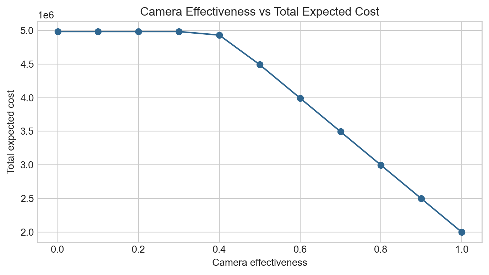

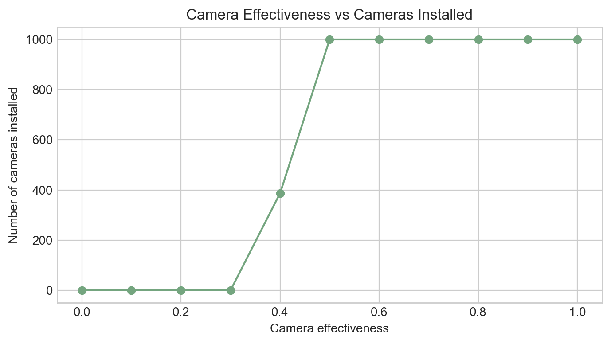

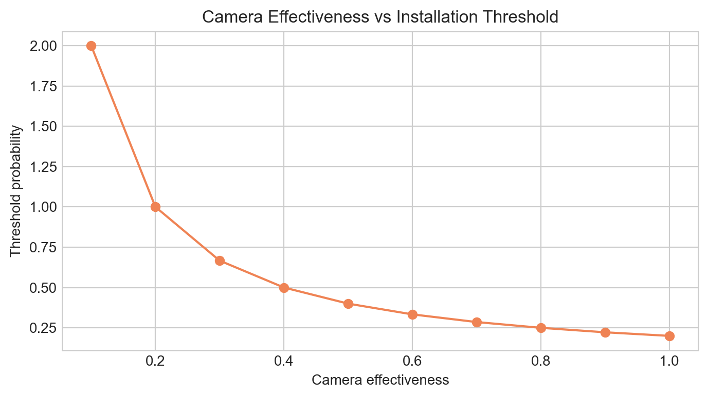

解讀：
- 當 effectiveness 很低時，threshold 會高於 1，因此沒有任何 machine 值得安裝 camera。
- effectiveness 提升時，threshold = 0.2 / e 會下降，表示只要 camera 更有效，就算機器只有中度風險也可能值得投資。
- 一旦 threshold 進入模型機率分布的密集區間，建議安裝數量會快速增加，形成明顯的轉折點。

## 5. Additional Insights and Strategic Recommendations
Budget scenarios:

| budget | selected_machine_count | installation_cost | total_expected_cost | avg_probability_selected | min_probability_selected |
| --- | --- | --- | --- | --- | --- |
| 50.0000 | 50.0000 | 100,000.0000 | 4,815,231.6979 | 0.5378 | 0.5372 |
| 100.0000 | 100.0000 | 200,000.0000 | 4,646,886.3117 | 0.5372 | 0.5359 |
| 200.0000 | 200.0000 | 400,000.0000 | 4,312,841.6043 | 0.5356 | 0.5330 |

- 若預算有限，應優先安裝在 predicted probability 與 expected benefit 最高的點位，而不是先從所有 outdoor 位置下手。
- 模型支持的建議：優先處理距離便利商店較遠、社團活動暴露較高、且屬於高 broken-rate building type 的位置。
- 合理但需要進一步驗證的建議：調整高風險販賣機位置、在社團活動日增加巡邏、補強照明與現場管理密度。
- 風險分群可以作為營運 SOP：Low risk 以例行巡檢為主，Medium risk 搭配重點巡檢或移機評估，High risk 優先考慮 camera 或實體監控升級。

## 6. Limitations and Next Steps
- 目前 target `Broken` 是過去一年結果，未必能完全代表下一年度行為模式。
- `Weekend` 與 `Club Activity Day` 來自日資料，但 target 是年度結果，因此存在時間尺度不一致問題。
- Candidate data 的 `indoor` 在部分 location 會隨日期切換，顯示原始資料品質可能有定義不一致，需要和資料提供方再確認。
- 模型整體 AUC 不高，代表現有變數只能解釋部分風險；若能加入人流量、照明、樓層、管理員、維修紀錄等變數，效果應可明顯提升。
- 若未來 camera 安裝後改變 vandalism 行為，模型需要重新校正，不能假設歷史資料永遠有效。
